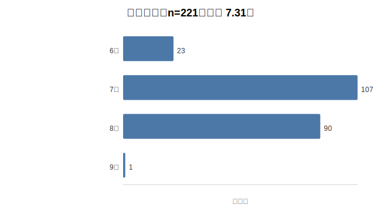
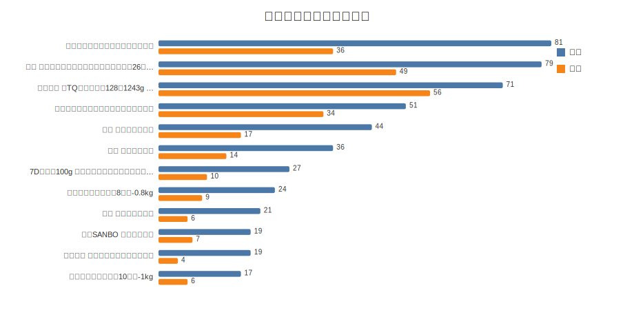
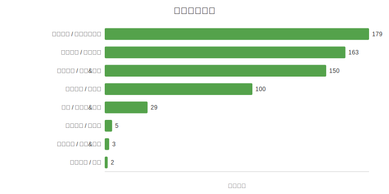
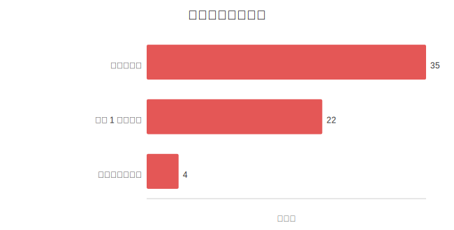

# 网站系统介绍与推荐日志分析

## 1. 网站系统、功能与推荐特点

本系统是一个面向微信小程序店铺的对话式商品推荐网站。用户不需要在传统商品列表中逐页筛选，而是可以直接用自然语言描述购买需求，例如“办公室下午茶想买几样，别太甜”“一百块左右送朋友”“宿舍想囤点便宜量大的零食”。系统根据用户输入理解购买场景、预算、品类和偏好，再从本地商品库中选择合适商品，并以“文字分析 + 商品卡片”的形式返回推荐结果。商品卡片包含商品名称、价格、规格、推荐理由和小程序二维码，用户可以进一步扫码进入商品详情页。

系统前端采用原生 HTML、CSS 和 JavaScript 实现，不依赖大型前端框架。用户在聊天窗口输入需求后，前端通过 `POST /api/recommend/stream` 请求后端，并使用 SSE 流式接收推荐结果。这样可以让模型回答逐步显示，减少用户等待时的空白感。桌面端页面采用聊天区和商品卡片区并列展示，移动端则使用底部抽屉展示商品卡片，使其适配不同屏幕尺寸。

后端分为开发环境和生产环境两套入口。开发环境由 `server.js` 提供本地 Node.js 服务；生产环境部署在 Cloudflare Pages Functions 中。核心推荐逻辑集中在 `src/recommendation-core.js`，该模块同时被 Node.js 和 Cloudflare Workers 使用，因此代码中避免使用强绑定某一运行环境的 API。商品数据来自 `商品.xlsx` 和本地二维码图片，构建时由脚本生成 `public/data/products.json`。当前商品库包含 55 个商品，每个商品记录了商品 ID、名称、品牌、类目、价格、规格、二维码路径和用于检索的 `searchText` 字段。

推荐流程可以概括为“意图规划、候选召回、模型选择、流式解释”四个阶段：

1. **意图规划**：系统首先调用大模型或本地规则分析用户输入，判断本轮对话是普通聊天、类目概览、商品搜索还是商品推荐。同时提取查询词、推荐数量、预算、类目提示和约束条件。例如，用户输入“预算九十以内礼盒推荐”时，系统会识别出推荐意图、查询词“礼盒”和预算上限 90 元。
2. **候选召回**：系统根据查询词从本地商品库中召回候选商品。召回阶段会对商品名称、品牌、类目、规格和 `searchText` 进行文本匹配，并结合价格倾向、送礼场景等规则计算候选分数。
3. **模型选择**：如果配置了大模型 API，系统会将候选商品列表发送给模型，由模型在候选范围内选择最多 3 个商品，并生成简短推荐理由。模型只能从候选商品中选择，不能编造商品、价格、库存或二维码。
4. **流式解释**：最后，系统基于已选商品生成面向用户的推荐说明，说明整体筛选依据、各商品适用场景和差异。解释文本通过 SSE 流式返回，商品卡片则单独作为结构化数据返回前端。

该系统的主要特点是将大模型与结构化商品库结合起来。大模型负责理解用户自然语言和生成可读解释，本地商品库负责约束推荐范围，避免模型凭空生成不存在的商品。与纯关键词搜索相比，对话式推荐能更好地处理“送朋友”“办公室下午茶”“不要太甜”“预算一百左右”等模糊需求；与完全由大模型自由回答相比，商品卡片和本地库存约束又能提高推荐结果的可验证性。

不过，从日志分析看，当前推荐系统仍然偏向“文本召回 + 大模型选择”的模式。也就是说，系统已经能较稳定地返回商品卡片，但预算、场景、商品属性等约束还没有充分前置到算法层。后续优化应更多从候选过滤、排序特征、商品标签和回答模板入手，而不是仅依赖提示词约束模型。

## 2. 基于记录数据的推荐算法与模型回答分析

本次分析使用系统 `logs` 目录中的两类日志文件：

- `logs/chat-conversations.jsonl`：记录每次对话请求，包括用户输入、模型回答、意图规划、候选匹配、最终推荐商品、耗时和错误信息。
- `logs/chat-events.jsonl`：记录用户交互事件，包括评分和商品详情点击。

日志共包含 235 条会话记录和 521 条交互事件，其中评分事件 221 条，商品详情点击事件 300 条。记录时间集中在 2026 年 7 月 13 日 20:23 至 21:02（北京时间）。由于时间跨度很短，且 `userAgent` 多为 `node`，这批数据更接近集中模拟测试数据，而不是长期真实用户流量。因此，本文主要将其用于发现算法问题和构建优化思路，而不直接作为商业转化结论。

### 2.1 总体数据表现

| 指标 | 数值 | 说明 |
| --- | ---: | --- |
| 会话数 | 235 | 全部完成 |
| session 数 | 12 | 会话来源较集中 |
| 推荐模式 | 229 条 `llm`，5 条 `no_match`，1 条 `chat` | 主流程以商品推荐为主 |
| 有推荐商品的请求 | 229 | 大部分请求返回了商品卡片 |
| 评分覆盖 | 221 / 235，94.0% | 覆盖率很高，符合模拟数据特征 |
| 平均评分 | 7.31 / 10 | 评分主要集中在 7、8 分 |
| 有详情点击的请求 | 213 / 235，90.6% | 点击率偏高，应谨慎解释 |
| 平均耗时 | 37.5 秒 | 模型调用链路耗时较长 |



从评分分布看，用户评分主要集中在 7 分和 8 分。其中 7 分有 107 条，8 分有 90 条，6 分有 23 条，9 分只有 1 条。这说明推荐结果整体可用，但高满意度样本较少。系统已经能够理解多数购物需求并返回商品，但结果还没有达到“非常贴合”的程度。

### 2.2 商品曝光与点击分析



| 商品 | 曝光 | 点击 | 粗略点击率 | 平均评分 |
| --- | ---: | ---: | ---: | ---: |
| 【诺梵】鲜萃黑巧（腰果味）四袋装 | 81 | 36 | 44.4% | 7.22 |
| 洽洽 香瓜子喜瓜子款 | 79 | 49 | 62.0% | 7.39 |
| 三只松鼠迎富礼盒 | 71 | 56 | 78.9% | 7.46 |
| 今麦郎一桶半红烧牛肉面整箱 | 51 | 34 | 66.7% | 7.24 |
| 无穷 年货零食大礼包 | 44 | 17 | 38.6% | 7.43 |
| 无穷 年货零食礼盒 | 36 | 14 | 38.9% | 7.33 |
| 7D 芒果干 100g | 27 | 10 | 37.0% | 6.80 |

从商品曝光看，推荐结果集中在少数 SKU 上。诺梵黑巧、洽洽瓜子、三只松鼠礼盒和今麦郎方便面出现频率较高。这说明当前算法在泛化场景下容易反复选择少量“通用商品”。例如，用户提出“办公室零食”“下午茶”“便携食品”“小零食”等需求时，系统经常推荐黑巧、瓜子或方便面。

这种集中曝光有一定合理性，因为这些商品价格较低、类目通用、商品信息完整。但过度集中也会带来两个问题：一是推荐结果缺少多样性，用户可能觉得系统每次都推荐相似商品；二是部分商品被放入不完全合适的场景，例如“便携食品，出门路上吃”时推荐整箱方便面，虽然属于食品，但场景匹配并不理想。

从点击和评分看，三只松鼠礼盒表现相对较好，曝光 71 次、点击 56 次、平均评分 7.46，说明它在送礼和礼盒类需求中较受欢迎。7D 芒果干平均评分较低，且商品数据中价格为 1000 元，明显不符合普通零食预期，可能存在价格数据异常，应优先检查。

### 2.3 类目分布分析



| 类目 | 推荐次数 | 点击次数 | 粗略点击率 | 平均评分 |
| --- | ---: | ---: | ---: | ---: |
| 休闲食品 / 其他休闲零食 | 179 | 63 | 35.2% | 7.35 |
| 休闲食品 / 方便速食 | 163 | 69 | 42.3% | 7.25 |
| 休闲食品 / 坚果&炒货 | 150 | 105 | 70.0% | 7.42 |
| 休闲食品 / 巧克力 | 100 | 43 | 43.0% | 7.24 |
| 酒水 / 葡萄酒&果酒 | 29 | 16 | 55.2% | 7.21 |

类目层面的主要问题是 `休闲食品` 类目过宽。商品库中大量商品都属于休闲食品，因此当用户输入比较模糊的需求时，算法容易在休闲食品大类下进行宽泛匹配，而没有进一步区分“即食零食”“需加热速食”“礼盒”“冷链食品”“办公室分享装”等细分属性。

例如，“办公室下午茶”更适合独立小包装、低气味、不需要加热、便于分享的商品；“加班晚上吃”更适合方便速食；“送长辈”更适合礼盒、品牌辨识度和价格区间稳定的商品。当前算法主要依赖商品名称和类目文本，缺少这些场景化标签，因此在一些场景中会出现词面相关但使用场景偏差的推荐。

### 2.4 预算约束分析

预算约束是当前日志中最明显的问题。



在 35 条带明确预算的推荐请求中，有 22 条至少推荐了 1 款超预算商品，有 4 条全部推荐商品都超过预算。典型样例如下：

| 用户需求 | 系统识别预算 | 实际推荐价格 |
| --- | ---: | --- |
| 办公室下午茶预算每人十几块 | 15 | 34.5、23.5、1000 |
| 给男生朋友送食品，预算一百以内 | 100 | 175、150、155 |
| 预算九十以内礼盒推荐 | 90 | 100、155、97 |
| 预算六十左右送朋友食品 | 60 | 128、97、181 |
| 预算三十以内，想买点小零食 | 30 | 34.5、23.5、40 |

这些案例说明，系统在意图规划阶段已经能识别预算，例如 `budgetMax=90` 或 `budgetMax=60`，但后续候选过滤和排序阶段没有把预算作为强约束执行。也就是说，预算只停留在模型可见的信息中，没有真正转化为算法层的过滤条件。

优化时应区分“硬预算”和“软预算”。当用户说“以内”“不超过”“低于”“最多”时，预算应作为硬上限，超过预算的商品不应进入主推荐列表。当用户说“左右”“上下”“大概”时，可以允许 15% 到 20% 的浮动，但超出浮动范围的商品仍应排除。如果为了补足推荐数量而必须推荐超预算商品，也应在理由中明确说明“略超预算”或“作为备选”。

### 2.5 模型回答质量分析

除推荐商品本身外，模型回答文本也存在需要优化的地方。日志中可观察到以下问题：

| 问题 | 数量 | 影响 |
| --- | ---: | --- |
| 提到“右侧/二维码” | 229 | 在当前网页布局下合理，但如果迁移到其他入口，表达会失效 |
| 正文超过 500 字 | 85 | 回答偏长，影响用户快速决策 |
| 出现“用户评价/评价”等未提供字段 | 35 | 存在事实越界风险 |
| 出现“无糖、低糖、不甜、无需冷藏、无需任何加工”等绝对判断 | 23 | 商品库没有这些结构化字段支撑 |
| 推荐数量表述不一致 | 2 | 用户要求一两款时，正文仍可能说“补充一款替代选项” |

这些问题说明，模型在解释推荐结果时仍有一定自由发挥。商品库只提供名称、品牌、类目、价格、规格和二维码路径，并没有提供营养成分、储存方式、真实用户评价、包装质感等信息。因此，模型不应断言“低糖”“无糖”“无需冷藏”“用户评价好”等无法由数据支撑的内容。

模型回答的优化方向是从自由生成转向受控生成。推荐理由应主要引用结构化字段，例如商品名称、价格、规格、类目、品牌和算法给出的推荐角度。对于没有字段支撑的属性，只能用保守表达，例如“名称中未明确标注糖分，建议扫码查看详情确认”，而不能直接给出肯定判断。

此外，当前回答普遍偏长。对商品推荐网站而言，用户更关心“为什么推荐”“价格是否合适”“哪款更符合我的场景”。因此回答可以压缩为三段：第一段说明筛选依据，第二段按商品列出核心理由，第三段给出选择建议。二维码和商品详情入口可以由前端商品卡片承担，不必每次在模型正文中重复说明。

## 3. 基于数据的推荐算法优化方案

### 3.1 将约束前置到候选过滤层

当前系统的主要问题不是无法理解用户意图，而是理解出的约束没有充分进入排序算法。后续可以将推荐流程调整为：

1. 意图规划阶段输出结构化约束，包括预算、预算类型、品类、使用场景、送礼对象、是否即食、是否需要分享、推荐数量等。
2. 候选过滤阶段先执行硬约束，例如预算上限、二维码可用、明确排除冷链或需加热商品。
3. 排序阶段再计算软分数，例如词面相关度、场景匹配度、价格接近度、品牌和礼盒属性、历史点击和评分。
4. 模型只在过滤后的候选池中选择商品，并负责生成解释，不再承担主要约束执行工作。

这样可以减少大模型自由判断带来的不稳定性，使推荐结果更可控。

### 3.2 重构预算匹配逻辑

预算应成为独立的排序特征和过滤条件。可以增加以下字段：

- `budgetMax`：预算上限。
- `budgetStrict`：是否为严格预算。
- `budgetTolerance`：模糊预算的容忍比例。
- `priceFitScore`：商品价格与预算的匹配分。
- `overBudgetPenalty`：超预算惩罚。

规则示例：

```js
const upper = budgetMax * (1 + budgetTolerance);
if (budgetStrict && product.priceMin > budgetMax) return null;
if (!budgetStrict && product.priceMin > upper) return null;
if (product.priceMin > budgetMax) score -= 30;
score += 12 * (1 - Math.abs(product.priceMin - budgetMax) / budgetMax);
```

通过这种方式，预算不再只是提示词中的信息，而是直接影响候选商品是否能被推荐。

### 3.3 为商品补充离线标签

目前商品主要依靠 `searchText` 检索，缺少结构化属性。建议在商品构建阶段为每个商品补充标签，例如：

- `packageType`：礼盒、礼包、整箱、独立小包、单品。
- `usageTags`：送礼、办公室、宿舍、聚会、家庭分享、早餐、夜宵。
- `foodState`：即食、需冲泡、需加热、冷冻/冷链、酒水。
- `tasteTags`：甜、咸、巧克力、果味、肉类、坚果、酒。
- `portionTags`：便携、分享装、大容量、小规格。
- `priceBand`：30 元内、30-60 元、60-100 元、100-200 元、200 元以上。
- `dataWarnings`：价格异常、规格缺失、疑似冷链、二维码缺失。

商品库只有 55 个商品，因此这些标签可以先通过规则自动生成，再人工校正。补充标签后，系统可以更准确地区分“办公室零食”和“加班速食”，“送礼礼盒”和“日常零食”，“便携即食”和“需要加热”。

### 3.4 控制查询扩展范围

当前 `enrichCatalogQuery()` 会把“吃的”“零食”等词扩展成“甜品、坚果、巧克力、方便面、牛排、粽子”等宽泛词。这样能提高召回率，但也会引入不合适的候选。优化时应区分用户原始强词和系统扩展弱词：强词用于主要排序，弱词只用于补充召回。对于“办公室”“便携”“路上吃”“不需要加热”等场景，应降低方便面、粽子、牛排、冷链商品的权重。

### 3.5 增加多样性与去重机制

在泛化需求下，系统应避免连续推荐过多同品牌、同类目或同名称前缀的商品。可以设置默认规则：每次推荐最多出现 1 个同品牌同类目商品；只有当用户明确要求“同类对比”“不同规格”“大礼包”时，才允许推荐多个相似 SKU。这样既能保持推荐相关性，也能提升用户看到的选择多样性。

### 3.6 利用点击和评分做轻量重排

日志中的点击和评分可以用于反馈优化，但由于当前数据更像模拟流量，不应直接强依赖。可采用平滑统计方式，例如：

- 商品点击率：`(clicks + 1) / (exposures + 5)`。
- 商品评分修正：商品平均评分减去全局平均评分，并按样本数衰减。
- 类目级反馈优先于商品级反馈，避免单个商品样本过少导致排序波动。
- 对价格异常且评分较低的商品增加惩罚。

这种轻量重排可以逐步把表现更好的商品前移，例如在送礼场景中提高三只松鼠礼盒等高点击、高评分商品的权重。

### 3.7 改进无匹配处理

日志中有 5 条 `no_match`，其中部分请求其实是泛需求，例如“想买可直接扫码查看详情的商品”“预算一百左右，综合推荐三款”。这类请求不应直接返回无匹配，而应进入综合推荐逻辑：在预算范围内选择多个代表类目商品，并说明“根据当前商品库综合推荐”。只有用户查询的品类与商品库完全无关时，才应返回无匹配。

### 3.8 规范模型回答

模型回答应由自由生成改为模板化生成。建议固定为：

1. 一句话概括筛选依据。
2. 每个商品用 1 到 2 句说明价格、规格、类目和场景匹配点。
3. 最后给出选择建议，例如“预算优先选 A，送礼优先选 B，分享优先选 C”。

同时增加禁止规则：不得编造用户评价、库存、优惠、物流、营养成分、储存方式和未提供的包装质感；不得用“必买”“闭眼入”等广告化词汇；不得在没有数据支撑时断言“无糖”“低糖”“不甜”。这些限制可以降低模型幻觉，使回答更适合商品导购场景。

## 4. 小结

通过日志分析可以看出，该网站已经实现了较完整的对话式商品推荐流程，能够将用户自然语言需求转化为商品卡片和解释文本。系统的优势在于大模型理解能力和本地商品库约束相结合，使推荐既有自然语言交互体验，又能绑定真实商品。

但当前系统仍存在预算约束执行不足、类目匹配过宽、商品曝光过于集中、模型回答偶尔越界等问题。后续优化应把重点放在推荐算法的结构化约束上：用预算过滤保证价格合理，用商品标签提高场景匹配，用多样性重排减少重复推荐，用点击和评分信号进行轻量反馈优化，并用模板化回答控制模型输出。这样可以使推荐结果从“基本可用”进一步提升到“更准确、更稳定、更可信”。
